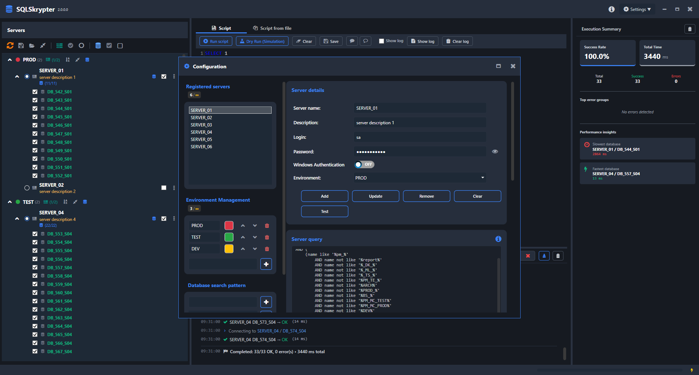
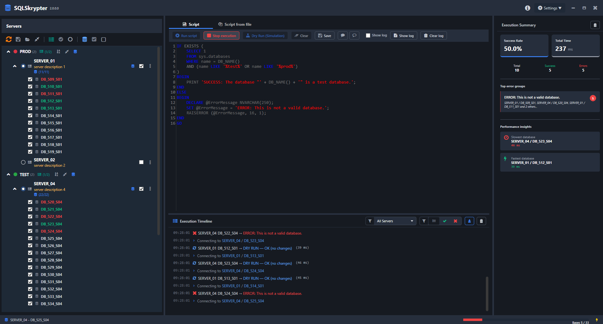

# SQLSkrypter

**A fast and secure T-SQL Runner for MSSQL (SQL Server) instances.**

[English Version](#english) | [Polska Wersja](#polski)

---

  
  
<i>Secure T-SQL execution across multiple MSSQL databases simultaneously.</i>

---

## 🌍 English

**SQLSkrypter** is a fast and lightweight **SQL Runner** — not a database browser. It is designed for DBAs and developers who need to safely execute T-SQL scripts across many **MSSQL (SQL Server)** instances at once. The focus is on speed, safety, and 100% offline data privacy.

### 🚀 Key Features

*   **Dual Workspace**: Switch between the **Script Editor** (single inline query) and **Script Files** mode (batch execution of multiple `.sql` files with drag & drop support and custom order).
*   **Live T-SQL Syntax Validation**: Errors are highlighted in real-time as you type using the offline `TSql160Parser` (SQL Server 2022 engine). Error messages include line and column numbers.
*   **Dry-run Simulation**: Execute your script inside a SQL Transaction that is automatically rolled back. Test on production with zero risk to data — before committing anything.
*   **Parallel Execution (PRO)**: Run scripts on multiple servers simultaneously using an async semaphore engine for maximum throughput.
*   **Execution Cancellation**: Stop a running batch mid-way at any point without hanging the UI.
*   **Color-Coded Environments**: Assign custom hex colors to environment groups (e.g., 🔴 Production, 🟢 Dev). Visual safety cues prevent accidental execution on the wrong server.
*   **Connection Test**: Verify that a server is reachable before launching a large batch.
*   **Execution Statistics**: After every run, see a summary: total count, success/error breakdown, and fastest/slowest database.
*   **Intelligent Error Grouping**: Identical errors across multiple databases are clustered into one entry — instantly revealing infrastructure-wide issues.

### 📸 Gallery

<table border="0">
  <tr>
    <td>
       
      <b>Fleet Management</b> 
      Color-coded environments for safe execution.
    </td>
    <td>
       
      <b>Parallel Optimization</b> 
      Maximum execution speed across all servers.
    </td>
  </tr>
</table>

### 💎 Edition Comparison

| Feature | Standard (Free) | PRO Edition |
| :--- | :---: | :---: |
| **Max Servers** | 10 Servers | **Unlimited** |
| **Max Environments** | 3 Groups | **Unlimited** |
| **Parallel Execution** | ❌ | **✅ Yes** |
| **Dry-run Simulation** | ❌ | **✅ Yes** |
| **Tree Session Saving** | ❌ | **✅ Yes** |
| **Config Import/Export** | ❌ | **✅ Yes** |
| **Auto-Updates (GitHub Releases)** | ❌ | **✅ Yes** |

### 🌍 Supported UI Languages

🇵🇱 Polish · 🇬🇧 English · 🇩🇪 German · 🇪🇸 Spanish · 🇫🇷 French · 🇮🇹 Italian

---

## 🇵🇱 Polski

**SQLSkrypter** to lekkie i wydajne narzędzie typu **SQL Runner** — nie przeglądarka baz danych. Stworzone dla administratorów DBA i deweloperów, którzy potrzebują bezpiecznego i szybkiego sposobu na masowe wykonywanie skryptów T-SQL w środowiskach **Microsoft SQL Server (MSSQL)**.

### 🚀 Kluczowe Funkcjonalności

*   **Dwa tryby pracy**: Przełączaj się między **Edytorem skryptów** (pojedyncze zapytanie) a trybem **Pliki SQL** (wsadowe wykonywanie wielu plików `.sql` z obsługą drag & drop i własną kolejnością).
*   **Walidacja składni T-SQL w czasie rzeczywistym**: Błędy są podkreślane na bieżąco przy użyciu silnika `TSql160Parser` (SQL Server 2022) — w aktywnym języku UI, z numerem linii i kolumny.
*   **Symulacja (Dry-run)**: Wykonaj skrypt w transakcji SQL, która jest automatycznie wycofywana. Testuj na produkcji bez żadnego ryzyka dla danych.
*   **Równoległe Wykonywanie (PRO)**: Uruchamiaj skrypty na wielu serwerach jednocześnie dzięki silnikowi asynchronicznemu z semaforem.
*   **Anulowanie w trakcie**: Zatrzymaj działający batch w dowolnym momencie bez zawieszania UI.
*   **Kolorowe Środowiska**: Przypisz własne kolory hex do grup (np. 🔴 Produkcja, 🟢 Dev). Wizualne wskazówki bezpieczeństwa chronią przed pomyłkowym wykonaniem na złym serwerze.
*   **Test połączenia**: Sprawdź dostępność serwera przed uruchomieniem dużego batcha.
*   **Statystyki wykonania**: Po zakończeniu sesji widzisz: liczbę ogółem, błędy/sukcesy, najszybszą i najwolniejszą bazę.
*   **Inteligentna Agregacja Błędów**: Identyczne błędy z wielu baz są grupowane w jeden wpis — natychmiast wskazując problem infrastrukturalny.

---

## 🔗 Linki / Links

*   🌐 **[Oficjalna Strona / Website](https://rotgamedev.github.io/SQLSkrypter/)**
*   🎁 **[Pobierz wersją Trial / Download Trial](https://rotgamedev.github.io/SQLSkrypter/#download)**
*   📜 **[Lista Zmian / Changelog](https://github.com/rotgamedev/SQLSkrypter/releases)**

---

## 📧 Kontakt / Contact

*   **Email**: [sqlskrypter@gmail.com](mailto:sqlskrypter@gmail.com)

---
*Note: SQLSkrypter uses Microsoft SMO and ScriptDom for reliable MSSQL interaction.*
